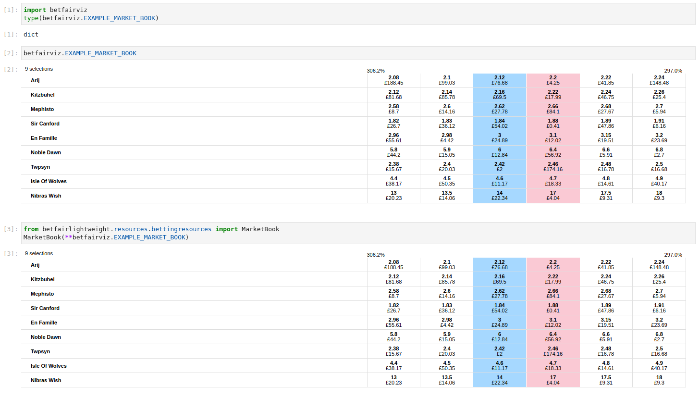
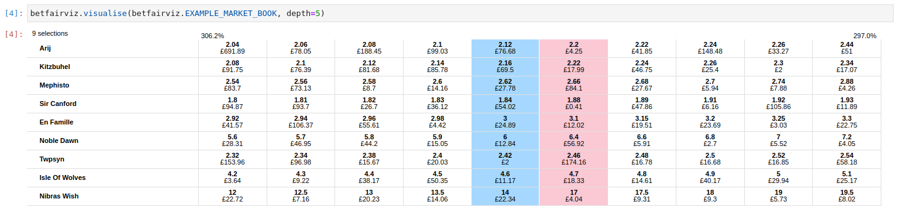
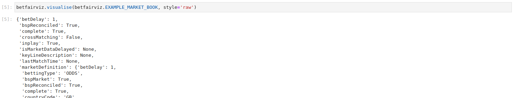

# betfairviz

Create visualisations of Betfair order books

# Installation

Requires Python 3.5 or above.

```
pip install git+https://github.com/mberk/betfairviz.git@master#egg=betfairviz
```
# Usage

Currently, the package is intended to be used inside a Jupyter notebook. When the package is imported, any objects which
are either a `betfairlightweight` `MarketBook` or an equivalent `dict` will automatically be rendered in a similar
fashion to the Betfair website:



More ladder levels can be displayed by using the visualise (or visualize) function (currently limited to a maximum of
5):



If you'd like to revert to displaying the order book as a dictionary, use the style argument to visualise:



# Planned Features

* Vertical ladders for individual runners
* Creating visualisations outside of a Jupyter notebook
* Other visualisations such as depth plots
* Customisable themes, e.g. dark mode

